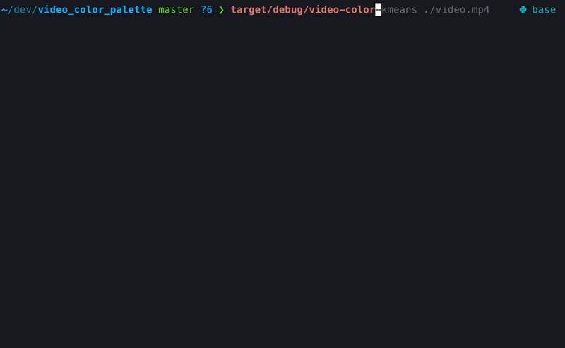

# video-color-kmeans

Extracts a color palette from a video using k-means clustering

## Usage

`video-color-kmeans [OPTIONS] <FILE>`

## Arguments
- `<FILE>`: The input video to parse for colors

## Options
- `-s, --saturation <SATURATION>`: Saturation threshold for colors (default: 0.0)
- `-l, --luminance <LUMINANCE>`: Luminance threshold for colors (default: 0.0)
- `-r, --resize-height <RESIZE_HEIGHT>`: Resize the video to this height (maintains
aspect ratio) (default: 12)
- `-c, --color-clusters <COLOR_CLUSTERS>`: Number of color clusters to create (default:
5)
- `--start <START>`: Start time of the video to extract colors (format: HH:MM:SS)
- `--end <END>`: End time of the video to extract colors (format: HH:MM:SS)
- `-h, --help`: Print help
- `-V, --version`: Print version

